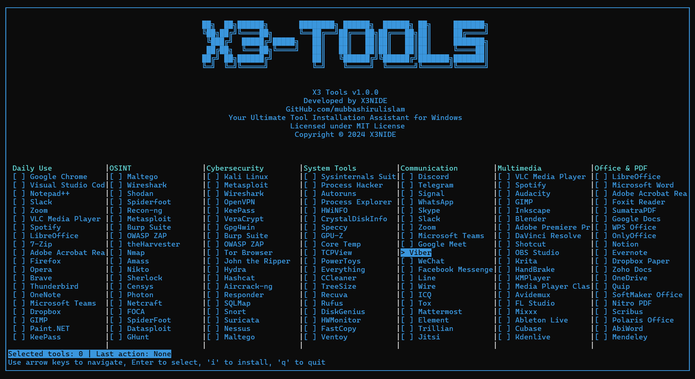

# X3-TOOLS: Windows Utility Installer



## Table of Contents
- [Overview](#overview)
- [Features](#features)
- [Installation](#installation)
- [Usage](#usage)
- [Tools Categories](#tools-categories)
- [Development](#development)
- [License](#license)
- [Acknowledgments](#acknowledgments)

## Overview

X3-Tools is a powerful, user-friendly Windows utility installer designed to streamline the process of setting up development environments, cybersecurity toolkits, and everyday software essentials. Developed single-handedly by X3NIDE with the assistance of AI, this tool represents a significant achievement in simplifying software installation on Windows platforms.

## Features

- **Intuitive TUI**: Navigate through categories and select tools with ease using our Terminal User Interface.
- **Curated Tool Selection**: Choose from a carefully curated list of essential tools across various categories.
- **One-Click Installation**: Install multiple tools simultaneously with a single command.
- **Windows Integration**: Utilizes the `winget` package manager for seamless installations.
- **Portable Executable**: Available as a standalone `.exe` file for plug-and-play functionality (requires admin privileges).
- **Customizable**: Easily extendable to include additional tools and categories.

## Installation

### Option 1: Executable (Recommended)

1. Download the `x3_tools.exe` from the [latest release](https://github.com/mubbashirulislam/X3Tools/releases/latest).
2. Right-click on `x3_tools.exe` and select "Run as administrator".

### Option 2: From Source

1. Ensure you have Python 3.7+ installed.
2. Clone the repository:
   ```
   git clone https://github.com/mubbashirulislam/X3-TOOLS.git
   ```
3. Navigate to the project directory:
   ```
   cd X3Tools
   ```
4. Install required dependencies:
   ```
   pip install -r requirements.txt
   ```
5. Run the script:
   ```
   python x3_tools.py
   ```

## Usage

1. Launch X3 Tools (either the executable or Python script).
2. Use arrow keys to navigate through categories and tools.
3. Press Enter to select/deselect tools for installation.
4. Press 'i' to begin installation of selected tools.
5. Follow on-screen prompts to complete the installation process.

## Tools Categories

X3 Tools offers a wide range of utilities across the following categories:

- Daily Use
- OSINT (Open Source Intelligence)
- Cybersecurity
- System Tools
- Communication
- Multimedia
- Office & PDF

For a complete list of tools, please refer to the [tool catalog](path/to/tool_catalog.md).

## Development

X3 Tools was developed as a solo project by X3NIDE, leveraging the power of AI assistance to overcome challenges and implement advanced features. The development process involved:

- Extensive research on Windows package management and software deployment.
- Implementing a robust Terminal User Interface (TUI) using the `curses` library.
- Integrating with the `winget` package manager for reliable software installation.
- Rigorous testing and debugging to ensure smooth operation across various Windows environments.
- Compiling the Python script into a standalone executable for easy distribution and use.

Contributions, bug reports, and feature requests are welcome! Please see our [contributing guidelines](CONTRIBUTING.md) for more information.

## License

This project is licensed under the MIT License - see the [LICENSE](LICENSE) file for details.


